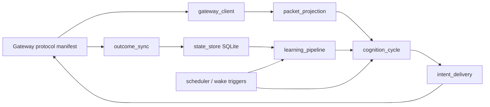

# Profile production hardening architecture

**Date:** 2026-08-18  
**Status:** proposed; paired production promotion blocked  
**Profile audit baseline:** [`fcfe99be975307690453a69baa623a2f2e843bd0`](https://github.com/GlitchTrader/glitch-topstep-hermes-profile/commit/fcfe99be975307690453a69baa623a2f2e843bd0)  
**Gateway audit baseline:** [`0588dc7bb3be66b5f6ce05cb05bf19da97116bc9`](https://github.com/GlitchTrader/glitch-topstep/commit/0588dc7bb3be66b5f6ce05cb05bf19da97116bc9)  
**Cross-repo design:** [`glitch-topstep production hardening architecture`](https://github.com/GlitchTrader/glitch-topstep/blob/codex/production-hardening-ledger-2026-08-18/docs/ledger/audits/2026-08-18-production-hardening-architecture.md)

## Decision

The profile remains an experimental cognition and learning component. It must not become a second source of provider truth, canonical outcomes, execution admission, or account mutation. Production hardening moves local cognitive state from shared/unbounded JSONL authority to indexed SQLite, consumes canonical outcomes through a revisioned cursor protocol, isolates all tests from the operator installation, and decomposes the large workers without changing Hermes authority.

## Target runtime



## Authority and failure isolation

- Gateway owns current venue evidence, intent admission, mutation, protection, reconciliation, receipts, and canonical outcome revisions.
- Profile owns prompt/cognition attempts, operator doctrine, delivery attempts, learning derivatives, schedules, and wake triggers.
- Learning failure may degrade learning and context; it must not block safe management/EXIT in the gateway.
- Protocol or identity failure must block mutation fail-closed and remain explicit in status.
- No profile process writes into a gateway database and no gateway process writes into the Hermes state directory.

## Outcome consumer

Tracked by [GTHP-PROD-01 #97](https://github.com/GlitchTrader/glitch-topstep-hermes-profile/issues/97) and gateway [TS-PROD-02 #110](https://github.com/GlitchTrader/glitch-topstep/issues/110).

Required local tables:

```text
outcome_cursor(source PRIMARY KEY, last_sequence, updated_utc)
outcome_revisions(outcome_id, revision, sequence UNIQUE, intent_id, status, content_hash, payload, received_utc, PRIMARY KEY(outcome_id, revision))
outcomes_current(outcome_id PRIMARY KEY, revision, sequence, intent_id, content_hash, payload)
learning_derivatives(outcome_id, outcome_revision, kind, derivative_version, facts_hash, status, payload, PRIMARY KEY(...))
```

The page loop validates sequence continuity, hash, identity, and revision ordering. Outcome revision, current projection, derivative invalidation/versioning, and cursor advance occur in one transaction. At-least-once delivery is expected; duplicate effect is forbidden.

Gap, retention-floor miss, hash mismatch, revision rollback, or conflicting identity sets a durable degraded-learning status. The profile requests an authenticated rebuild and does not silently continue from a newer cursor.

## Indexed state and migration

Tracked by [GTHP-PROD-02 #98](https://github.com/GlitchTrader/glitch-topstep-hermes-profile/issues/98).

State tables and indexes replace recurring full-file scans for decisions, minute frames, active trade lookup, outcome revisions, episodes, worker runs, wake triggers, and locks. JSONL remains an optional audit export, rotated and reconstructible.

Migration phases:

1. Open the new database and record a migration run with source file hashes.
2. Parse every legacy row with schema/version provenance.
3. UPSERT valid rows idempotently; classify duplicates and conflicts.
4. Write malformed/non-tail corruption to quarantine with filename, line, error, and raw hash.
5. Compare counts, latest identities, active trade, outcome current projection, and prompt-tail results.
6. Switch readers, then writers, under a reversible feature flag.
7. Keep legacy files read-only for a rollback window.
8. Generate compatibility exports from SQLite and retire direct append paths.

## Module boundaries

Tracked by [GTHP-PROD-04 #100](https://github.com/GlitchTrader/glitch-topstep-hermes-profile/issues/100).

- `gateway_client`: HTTP/auth/timeouts/retry/protocol, no cognition.
- `state_store`: migrations, transactions, cursors, locks, bounded queries.
- `packet_projection`: pure sanitization and prompt-size projection.
- `cognition_cycle`: context assembly and model invocation.
- `intent_delivery`: frozen body, idempotent retry, receipt reconciliation.
- `outcome_sync`: cursor/revisions/rebuild.
- `learning_pipeline`: facts, debriefs, episodes, correction handling.
- `scheduler`: cron/wake lifecycle only; no preselected trade action.

Existing scripts become thin entrypoints. Environment, clock, filesystem, and network are injected ports. Extraction proceeds under characterization tests one module at a time.

## Hermetic CI and immutable pair

Tracked by [GTHP-PROD-03 #99](https://github.com/GlitchTrader/glitch-topstep-hermes-profile/issues/99), gateway [TS-PROD-07 #115](https://github.com/GlitchTrader/glitch-topstep/issues/115), and [TS-PROD-08 #116](https://github.com/GlitchTrader/glitch-topstep/issues/116).

- Unit tests receive temporary Hermes/config/state roots and a deterministic clock.
- A guard fails any unit test that accesses the actual operator `%LOCALAPPDATA%\\hermes` tree.
- Linux and Windows jobs cover path, rename, lock, permission, and newline behavior.
- Live/install tests are opt-in, isolated, and non-mutating by default.
- Actions are pinned by immutable SHA and use least-privilege permissions.
- Pair CI installs gateway/profile artifacts by SHA, verifies checksums, and exercises current, boundary, and incompatible protocol fixtures.
- Release emits a pair manifest with protocol revision, schemas, prompt versions, capability revisions, artifact hashes, and provenance.

## Required fault tests

| Fault | Required result |
|---|---|
| profile dies after page fetch before commit | same page replays; no cursor advance |
| profile dies after SQLite commit before response handling | duplicate delivery has no duplicate effect |
| backlog exceeds 100 pages/items | every sequence consumed in order |
| revision arrives after debrief | derivative versioned or marked stale |
| JSONL contains malformed middle line | quarantine and degraded migration report |
| disk full or permission loss | cursor does not advance; visible error |
| gateway future protocol is incompatible | mutation delivery refused explicitly |
| Hermes installation is absent | unit suite still passes |
| worker lock owner dies / PID reused | safe lock recovery validates process identity |
| learning pipeline fails | execution management remains independent |

## Issue register

- [#97 GTHP-PROD-01](https://github.com/GlitchTrader/glitch-topstep-hermes-profile/issues/97) — revisioned outcome cursor/UPSERT.
- [#98 GTHP-PROD-02](https://github.com/GlitchTrader/glitch-topstep-hermes-profile/issues/98) — indexed durable profile state.
- [#99 GTHP-PROD-03](https://github.com/GlitchTrader/glitch-topstep-hermes-profile/issues/99) — hermetic tests and reproducible release CI.
- [#100 GTHP-PROD-04](https://github.com/GlitchTrader/glitch-topstep-hermes-profile/issues/100) — worker decomposition.

## Promotion stop lines

- Do not write directly to a shared outcome JSONL.
- Do not advance a cursor outside the effect transaction.
- Do not silently retain a debrief derived from superseded facts.
- Do not allow a unit test to read or mutate the installed operator profile.
- Do not infer a trading decision in scheduler, storage, sync, or compatibility code.
- Do not promote an independently latest profile; promote only a tested immutable pair.
