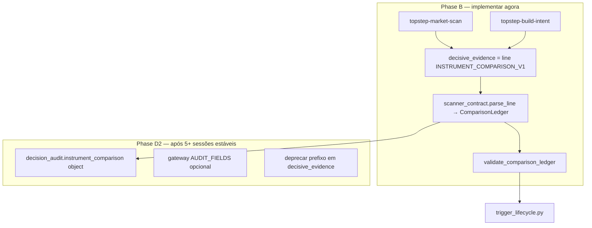

# GTHP-DATA-01 — Multi-instrument cognition (Glitch pattern → Phase D2)

**Paired gateway:** [TS-DATA-01 Phase D2](https://github.com/GlitchTrader/glitch-topstep/blob/main/docs/specs/TS-DATA-01.md) (#171)  
**Origin profile:** [glitch-hermes-profile](https://github.com/GlitchTrader/glitch-hermes-profile) (`glitch-market-scan`, `glitch-build-intent`, `validate_candidate_comparison`)  
**Status:** sketch / implementation plan  
**Date:** 2026-08-21

## Intent

Desbloquear cognition multi-instrumento (MNQ + MES + MCL no `market_universe`) **agora** com o padrão operacional do Glitch NinjaTrader, e deixar o caminho explícito para **Phase D2**: objeto nativo `decision_audit.instrument_comparison` sem parse de string.

O gateway Topstep já publica candidatos via `/scanner`. O bloqueio é Hermes-only: o LLM não entrega ledger `INSTRUMENT_COMPARISON_V1` válido.

## Trajetória (duas fases, um modelo interno)



**Regra:** `ComparisonLedger` (dict tipado) é a **forma canônica interna**. Phase B serializa/deserializa line ↔ ledger. Phase D2 lê/escreve o mesmo ledger como objeto JSON no audit.

---

## Forma canônica interna (`ComparisonLedger`)

Usada por validação, `trigger_lifecycle`, learning e (futuro) gateway.

```yaml
schema_version: glitch.topstep.instrument_comparison.v1
packet_id: "<packet_id>"
candidates:
  - instrument: MNQ
    current_auction: string
    bullish_path: string
    bearish_path: string
    next_transition: string
    prior_trigger_review: string   # flat scan: literal NOT_APPLICABLE
    asymmetry: string
    triggers:
      - trigger_id: string         # estável entre ciclos quando path unchanged
        source_packet_id: string
        path: BULLISH | BEARISH | NEXT
        condition: string          # frozen; ratchet em trigger_lifecycle
        expires_utc: string
        status: HELD | FAILED | EXPIRED
ranking: [MNQ, MES, MCL]           # todos os candidatos do packet
selected_instrument: MNQ             # top/reference; = packet.instrument em single_contract
selection_reason: string
```

`selection_action` **não** persiste no ledger longo prazo — espelha `intent.action` só na validação do ciclo (`SELECTION_ACTION` line / D2 optional field).

Compatível com o JSON antigo em `scanner_contract.py` (mesmos keys em `candidates[]`); Phase B troca apenas o **encoding** em `decisive_evidence`.

---

## Phase B — Line format (encoding em `decisive_evidence`)

Substituir `INSTRUMENT_COMPARISON_V1:{...json...}` por texto estruturado (padrão Glitch).

### Marker e blocos

```text
INSTRUMENT_COMPARISON_V1
INSTRUMENT MNQ:
CURRENT_AUCTION=<evidence from packet MNQ only>
BULLISH_PATH=<path or explicitly absent/conditional>
BEARISH_PATH=<path or explicitly absent/conditional>
NEXT_TRANSITION=<next state + evidence>
PRIOR_TRIGGER_REVIEW=NOT_APPLICABLE
ASYMMETRY=<coarse asymmetry; UNKNOWN only when evidence unusable>
TRIGGER_ID=<stable-id>
TRIGGER_PATH=NEXT
TRIGGER_CONDITION=<frozen condition>
TRIGGER_STATUS=HELD
INSTRUMENT MES:
...
INSTRUMENT MCL:
...
RANKING=MNQ,MES,MCL
SELECTION_INSTRUMENT=MNQ
SELECTION_ACTION=NOTHING
SELECTION_REASON=<comparative reason across all three>
```

### Regras de encoding

| Regra | Detalhe |
|-------|---------|
| Marker | Primeira linha exatamente `INSTRUMENT_COMPARISON_V1` (sem `:` JSON) |
| Cobertura | Um bloco `INSTRUMENT <ROOT>:` por candidato em `market_universe.candidates` |
| Placeholders | Proibido `REPLACE`, `REPLACE_WITH_*`, `...`, `?` |
| Ranking | Deve mencionar **todos** os roots esperados |
| `SELECTION_INSTRUMENT` | Deve igual `packet.instrument` / `account_selection.selected_instrument` em `single_contract` |
| `SELECTION_ACTION` | Deve igual `intent.action` |
| Enter scope | Se `ENTER_*`, `selected_instrument` deve ser o instrumento executável no scope |

### Onde vai `prior_hypothesis`

| Candidatos | `decisive_evidence` | `disconfirming_evidence` ou prefixo |
|------------|---------------------|-------------------------------------|
| ≤ 1 | `prior_hypothesis=...` + deltas (como hoje) | — |
| ≥ 2 | **somente** line `INSTRUMENT_COMPARISON_V1` | `prior_hypothesis=<...>` **no início** de `disconfirming_evidence` ou campo dedicado `change_condition` prefix |

Remover conflito em `CYCLE_OPERATOR_INSTRUCTION` e `topstep-build-intent`: nunca exigir `prior_hypothesis` **dentro** de `decisive_evidence` quando multi.

---

## 1. Skill `topstep-market-scan` (port de `glitch-market-scan`)

**Path:** `skills/topstep-market-scan/SKILL.md`  
**Fonte:** `GlitchTrader/glitch-hermes-profile/skills/glitch-market-scan/SKILL.md`

### Adaptações Topstep

- Candidatos = `decision_packet.market_universe.candidates[]` (não `market_snapshot.instruments`).
- Evidência comum para ranking (#171 C2): para **cada** candidato usar classes presentes em **todos** — bars/quote/`observation_quality` do scanner; **não** usar order flow do contrato selecionado como bônus de ranking.
- `MCL` = Micro Crude; `MCLE` = identidade ProjectX apenas.
- `market_alignment.synchronized == false`: calibrar timing com quote + order flow do **selecionado**; estrutura com 5m/60m + partial 1m; lag em `disconfirming_evidence`, não veto automático NOTHING.
- `session_levels.reliable == false`: não tratar `session_high/low` como edge estrutural.
- Execução: `account_selection.mode=single_contract` — ranking escolhe **melhor candidato cognitivo**; ordem só no instrumento em scope (`execution_mode=selected`).

### Conteúdo mínimo da skill (checklist)

1. Scan simétrico obrigatório antes de ranking.
2. Proibir default MNQ / primeiro da lista / histórico familiar.
3. Oito passos por instrumento (adaptar do Glitch): contexto, current setup, bull path, bear path, next setup, prior trigger review, auction winner, asymmetry — versão Topstep enxuta nos campos line acima.
4. Fechar com: preencher template line em `decisive_evidence` sem placeholders.
5. Referência cruzada: `topstep-build-intent` para serialização final.

### Registro no ciclo

Adicionar ao bundle cognitivo (hash de `prompt_version` se/quando existir bundle Topstep):

```python
"--skills",
"topstep-observe-market,topstep-market-scan,topstep-assess-risk,topstep-form-thesis,topstep-build-intent",
```

---

## 2. Estender `topstep-build-intent`

**Path:** `skills/topstep-build-intent/SKILL.md`

### Novo bloco (copiar espírito Glitch)

```markdown
## Multi-instrument flat scan

Serialization begins **only after** every eligible candidate has a complete
`INSTRUMENT_COMPARISON_V1` line ledger in `decisive_evidence`.

When `market_universe.candidates` has more than one entry:

- Put the **full** line ledger in `decision_audit.decisive_evidence` exactly as
  supplied in `required_output_template.decision_audit.decisive_evidence`.
- Put continuity in `disconfirming_evidence`:
  `prior_hypothesis=<CONFIRMED|INVALIDATED|PARTIALLY_CONFIRMED|UNCHANGED>; ...`
  when `recent_frames` is non-empty.
- `SELECTION_INSTRUMENT` equals `packet.instrument` (reference/top candidate in
  single_contract scope), even when `SELECTION_ACTION=NOTHING`.
- Do not emit JSON, Markdown fences, or a second comparison format.

`NOTHING` is allowed only after all instrument blocks are complete.
```

### Remover / condicionar

- Remover regra global: *"`decisive_evidence` must begin with `prior_hypothesis=`"* → mover para secção single-instrument ou `disconfirming_evidence`.

### Exemplo validado (fixture MNQ/MES/MCL)

Derivado de `tests/test_scanner_contract.py` + `tests/fixtures/paired/multi01_scanner_packet.json`:

```text
INSTRUMENT_COMPARISON_V1
INSTRUMENT MNQ:
CURRENT_AUCTION=partial 1m below 5m VWAP; quote fresh; observation ready
BULLISH_PATH=reclaim 5m VWAP with 1m higher low sequence
BEARISH_PATH=lose 1m partial low and 60m range mid
NEXT_TRANSITION=hold below VWAP → bearish continuation test
PRIOR_TRIGGER_REVIEW=NOT_APPLICABLE
ASYMMETRY=slight bearish edge; timing mixed; MNQ selected-contract flow neutral
TRIGGER_ID=mnq-next-vwap-reclaim
TRIGGER_PATH=NEXT
TRIGGER_CONDITION=1m close above 5m rolling_vwap_20 with non-negative 60s delta
TRIGGER_STATUS=HELD
INSTRUMENT MES:
CURRENT_AUCTION=...
...
INSTRUMENT MCL:
CURRENT_AUCTION=...
...
RANKING=MNQ,MES,MCL
SELECTION_INSTRUMENT=MNQ
SELECTION_ACTION=NOTHING
SELECTION_REASON=symmetric bars ready but no candidate retains positive EV after fees and scope
```

Manter este exemplo também em `tests/fixtures/paired/multi01_comparison_ledger.txt` para testes.

---

## 3. Ajustes em `run-topstep-cycle.py`

### 3.1 `build_prompt`

```python
MULTI_CANDIDATE = len(packet.get("market_universe", {}).get("candidates", [])) > 1

if MULTI_CANDIDATE:
    audit["decisive_evidence"] = comparison_line_template(packet)  # novo nome
    audit["disconfirming_evidence"] = (
        "Replace. When recent_frames non-empty, begin with "
        "prior_hypothesis=<CONFIRMED|INVALIDATED|PARTIALLY_CONFIRMED|UNCHANGED> "
        "then material deltas since prior frame."
    )
else:
    # decisive_evidence com prior_hypothesis (comportamento atual)
    ...
```

### 3.2 `CYCLE_OPERATOR_INSTRUCTION`

Substituir parágrafo multi-instrumento por:

- Com multi: `decisive_evidence` = **only** line ledger; continuity → `disconfirming_evidence`.
- Referenciar skill `topstep-market-scan`.
- Manter regras #171 alignment e symmetric ranking (já presentes).

### 3.3 `validate_intent`

Fluxo:

```python
if multi:
    ledger = validate_comparison_line(decisive, packet)  # parse + validate
else:
    validate_prior_hypothesis_prefix(decisive, frames)
```

Manter check `selected_instrument` vs `packet.instrument` em `ENTER_*`.

### 3.4 `backfill_constant_comparison_fields` (opcional, recomendado)

Port mínimo de Glitch `run-direct-glitch-cycle.py`:

- Após resposta do modelo, antes de `validate_intent`:
- Se line ledger presente e bloco instrumento **sem** linha `PRIOR_TRIGGER_REVIEW=`, inserir `PRIOR_TRIGGER_REVIEW=NOT_APPLICABLE`.
- **Nunca** backfill campos semânticos (`CURRENT_AUCTION`, paths, ranking).

### 3.5 `scanner_contract.py` refactor

| Função | Phase B | Phase D2 |
|--------|---------|----------|
| `comparison_line_template(packet)` | gera line com placeholders nomeados | idem ou deprecated |
| `parse_comparison_line(text) -> ComparisonLedger` | regex linha-a-linha | idem |
| `validate_comparison_ledger(text, packet)` | chama parse + asserts | dual: object **or** line |
| `serialize_comparison_line(ledger)` | round-trip testes | deprecated quando object-only |

Manter `MARKER = "INSTRUMENT_COMPARISON_V1"` (sem sufixo `:`) para line; deprecar `MARKER + json.dumps(...)`.

### 3.6 `trigger_lifecycle.py`

Trocar:

```python
value = json.loads(text[len(MARKER):])
```

por:

```python
value = parse_comparison_line(text)  # mesmo dict que D2 object
```

Sem mudança de comportamento de ratchet / `HELD` rescan.

---

## 4. Teste de regressão

**Novo arquivo:** `tests/test_multimarket_comparison_contract.py`  
**Modelo:** `GlitchTrader/glitch-hermes-profile/tests/test_multimarket_comparison_contract.py`

### Casos mínimos

| Teste | Assert |
|-------|--------|
| `test_template_lists_every_candidate` | MNQ, MES, MCL de `multi01_scanner_packet.json` |
| `test_complete_line_passes` | fixture `.txt` válida → `validate_comparison_ledger` OK |
| `test_missing_instrument_rejected` | remove bloco MES → `candidate_comparison_instruments` |
| `test_placeholder_rejected` | `CURRENT_AUCTION=REPLACE` → `candidate_comparison_field_placeholder` |
| `test_build_prompt_multi_uses_line_only` | `build_prompt` não contém `prior_hypothesis` em `decisive_evidence` |
| `test_round_trip` | parse → serialize → parse igual |

### Fixture

- `tests/fixtures/paired/multi01_scanner_packet.json` (existente)
- `tests/fixtures/paired/multi01_comparison_ledger.txt` (novo)

Atualizar `tests/test_direct_cycle.py` assert de template: marker line, não `INSTRUMENT_COMPARISON_V1:` JSON.

---

## Phase D2 — objeto nativo (destino longo prazo)

### Gate (ledger #171)

- Phases A–C estáveis ≥ 5 sessões
- `instrument_comparison_missing` ≈ 0 com Phase B
- Operador: `GLITCH_DATA_PHASE_D=1` + `GLITCH_DATA_PHASE_D_STABLE_AFTER_UTC`

### Wire shape (proposta)

Estender `glitch.intent.v3` **audit only** (non-breaking se gateway ignora keys extras até bump):

```json
{
  "decision_audit": {
    "bull_case": "...",
    "decisive_evidence": "prior_hypothesis=UNCHANGED; deltas only when multi",
    "disconfirming_evidence": "...",
    "instrument_comparison": {
      "schema_version": "glitch.topstep.instrument_comparison.v1",
      "packet_id": "...",
      "candidates": [ "... same as ComparisonLedger ..." ],
      "ranking": ["MNQ", "MES", "MCL"],
      "selected_instrument": "MNQ",
      "selection_reason": "..."
    },
    "final_choice": "NOTHING"
  }
}
```

### Migração B → D2

1. Hermes passa a **exigir** `instrument_comparison` object em multi-candidate; line em `decisive_evidence` opcional por 1 release (dual-write).
2. `validate_intent`: prefer object; fallback parse line; emit warning metric.
3. Gateway `AUDIT_FIELDS` + paired-contract bump `prompt_version`.
4. Learning / outcomes: ler object; parar de parse string.
5. Remover line encoding; atualizar `GTHP-TRIGGER-01.md`.

### Por que B antes de D2

| | Line (B) | Object (D2) |
|---|----------|-------------|
| LLM compliance | Alta (Glitch proof) | Média (nested JSON no audit) |
| Gateway change | Nenhuma | AUDIT_FIELDS + compat |
| trigger_lifecycle | parse line → ledger | read object |
| Effort now | Profile-only PR | Profile + gateway + contract |

Line format **não** é destino final — é **gerador de ledger confiável** até o gate D2.

---

## Arquivos tocados (PR profile)

| Arquivo | Ação |
|---------|------|
| `skills/topstep-market-scan/SKILL.md` | **criar** |
| `skills/topstep-build-intent/SKILL.md` | estender |
| `scripts/scanner_contract.py` | line parse/validate/template |
| `scripts/run-topstep-cycle.py` | skills, prompt, backfill, validate |
| `scripts/trigger_lifecycle.py` | usar `parse_comparison_line` |
| `tests/test_multimarket_comparison_contract.py` | **criar** |
| `tests/fixtures/paired/multi01_comparison_ledger.txt` | **criar** |
| `tests/test_scanner_contract.py` | adaptar para line |
| `tests/test_direct_cycle.py` | assert template line |
| `docs/specs/GTHP-TRIGGER-01.md` | nota Phase B line → D2 object |
| `SHA256SUMS` | regerar |

Gateway Topstep: **sem mudança** na Phase B.

---

## Ordem de implementação sugerida

1. `scanner_contract.py` — parse/validate line + template (TDD com `test_multimarket_comparison_contract.py`)
2. `topstep-market-scan` + `topstep-build-intent`
3. `run-topstep-cycle.py` — prompt/skills/backfill
4. `trigger_lifecycle.py` — parser unificado
5. Smoke: allowlist MNQ,MES,MCL, verificar ciclo Hermes sem `instrument_comparison_missing`
6. Documentar métricas para gate D2 (#171)

---

## Referências Glitch

| Glitch (NinjaTrader profile) | Topstep equivalente |
|------------------------------|---------------------|
| `skills/glitch-market-scan/SKILL.md` | `skills/topstep-market-scan/SKILL.md` |
| `skills/glitch-build-intent/SKILL.md` | `skills/topstep-build-intent/SKILL.md` |
| `candidate_comparison_template()` | `comparison_line_template()` |
| `validate_candidate_comparison()` | `validate_comparison_line()` |
| `backfill_constant_comparison_fields()` | idem (PRIOR_TRIGGER_REVIEW only) |
| `tests/test_multimarket_comparison_contract.py` | port + fixtures paired |

---

## Stop lines

- Não converter ranking incompleto em gate de execução no gateway.
- Não backfill paths/ranking — só constantes prescritas.
- Não manter JSON-in-string como formato paralelo após Phase B merge (dual-read só na janela D2).
- Phase D1 (order flow por candidato no scanner) **depois** de D2 object + métricas estáveis.
